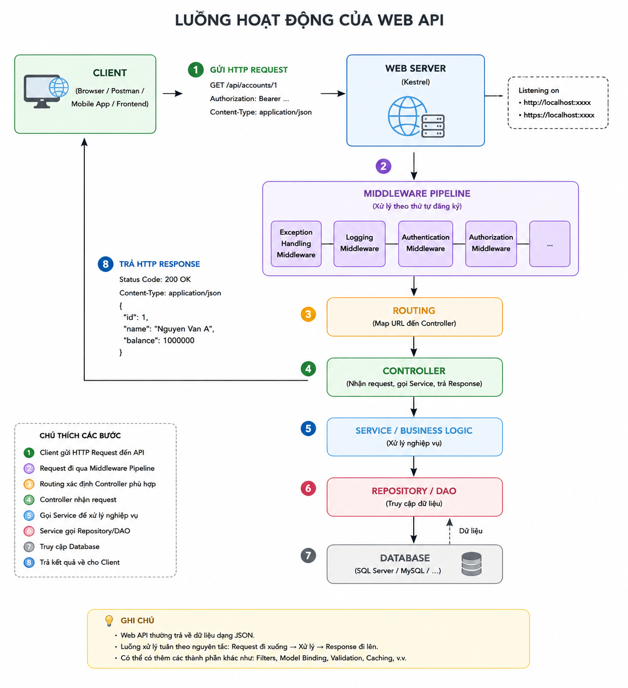

# Đăng ký API Endpoint trong ASP.NET Core Minimal API

## 1. API Endpoint là gì?

Trong ASP.NET Core Minimal API, **endpoint** là một địa chỉ API mà client có thể gửi HTTP Request tới để thực hiện một chức năng.

Ví dụ:

```text
GET /accounts
POST /login
PUT /accounts/123
DELETE /accounts/123
```

Trong `Program.cs`, endpoint được đăng ký bằng các phương thức như:

```csharp
app.MapGet(...)
app.MapPost(...)
app.MapPut(...)
app.MapPatch(...)
app.MapDelete(...)
```

---

## 2. Cấu trúc cơ bản

Cú pháp chung:

```csharp
app.MapXXX("/duong-dan", () =>
{
    // Code xử lý request

    return ...;
});
```

Trong đó:

* `MapXXX` → loại HTTP Method.
* `"/duong-dan"` → URL của endpoint.
* `() => { ... }` → lambda expression, chính là hàm xử lý khi endpoint được gọi.

Ví dụ:

```csharp
app.MapGet("/hello", () =>
{
    return "Hello";
});
```

Khi client gửi:

```http
GET /hello
```

thì lambda sẽ được thực thi.

---

# 3. Các kiểu đăng ký API

## 3.1. MapGet()

Dùng cho HTTP `GET`.

Thường dùng để **lấy dữ liệu**.

```csharp
app.MapGet("/accounts", () =>
{
    return "Danh sách tài khoản";
});
```

Request:

```http
GET /accounts
```

Ví dụ lấy một tài khoản:

```csharp
app.MapGet("/accounts/{stk}", (string stk) =>
{
    return $"Thông tin tài khoản {stk}";
});
```

Request:

```http
GET /accounts/123456
```

`{stk}` là route parameter và giá trị `123456` sẽ được truyền vào biến `stk`.

---

## 3.2. MapPost()

Dùng cho HTTP `POST`.

Thường dùng khi **gửi dữ liệu lên server**, tạo dữ liệu hoặc thực hiện một hành động.

Ví dụ đăng nhập:

```csharp
app.MapPost("/login", (LoginRequest req) =>
{
    // Xử lý đăng nhập

    return "Đăng nhập thành công";
});
```

Client có thể gửi:

```json
{
    "stk": "123456",
    "mk": "123456"
}
```

Trong trường hợp này:

```csharp
(LoginRequest req)
```

là dữ liệu được nhận từ request body.

Ví dụ với project ngân hàng:

```csharp
app.MapPost("/transfer", (TransferRequest req) =>
{
    // Xử lý chuyển tiền

    return "Chuyển tiền thành công";
});
```

---

## 3.3. MapPut()

Dùng cho HTTP `PUT`.

Thường dùng để **cập nhật/thay thế toàn bộ thông tin của một resource**.

Ví dụ:

```csharp
app.MapPut("/accounts/{stk}", (string stk, Account account) =>
{
    // Cập nhật toàn bộ thông tin tài khoản

    return "Cập nhật thành công";
});
```

Request:

```http
PUT /accounts/123456
```

Body:

```json
{
    "ten": "Nguyen Van A",
    "diaChi": "Ha Noi"
}
```

---

## 3.4. MapPatch()

Dùng cho HTTP `PATCH`.

Thường dùng khi muốn **cập nhật một phần dữ liệu**.

Ví dụ tài khoản có:

```text
STK
Tên
Địa chỉ
Số điện thoại
```

Chỉ muốn sửa địa chỉ:

```csharp
app.MapPatch("/accounts/{stk}", (string stk, AccountUpdate data) =>
{
    // Chỉ cập nhật địa chỉ

    return "Cập nhật thành công";
});
```

Request:

```http
PATCH /accounts/123456
```

Body:

```json
{
    "diaChi": "Hai Phong"
}
```

---

## 3.5. MapDelete()

Dùng cho HTTP `DELETE`.

Thường dùng để **xóa dữ liệu**.

```csharp
app.MapDelete("/accounts/{stk}", (string stk) =>
{
    // Xóa tài khoản

    return "Xóa thành công";
});
```

Request:

```http
DELETE /accounts/123456
```

---

# 4. So sánh các Map

| Method        | HTTP   | Mục đích                             | Ví dụ         |
| ------------- | ------ | ------------------------------------ | ------------- |
| `MapGet()`    | GET    | Lấy dữ liệu                          | Lấy tài khoản |
| `MapPost()`   | POST   | Tạo/gửi dữ liệu, thực hiện hành động | Đăng nhập     |
| `MapPut()`    | PUT    | Cập nhật/thay thế                    | Sửa tài khoản |
| `MapPatch()`  | PATCH  | Cập nhật một phần                    | Sửa địa chỉ   |
| `MapDelete()` | DELETE | Xóa dữ liệu                          | Xóa tài khoản |

Có thể nhớ đơn giản:

```text
GET     → Lấy
POST    → Tạo / Gửi / Thực hiện
PUT     → Cập nhật toàn bộ
PATCH   → Cập nhật một phần
DELETE  → Xóa
```

---

# 5. Lambda trong MapGet/MapPost

Ví dụ:

```csharp
app.MapGet("/hello", () =>
{
    return "Hello";
});
```

Phần:

```csharp
() =>
{
    return "Hello";
}
```

là **lambda expression**.

Có thể hình dung nó tương đương với một hàm có tên:

```csharp
string XuLyHello()
{
    return "Hello";
}

app.MapGet("/hello", XuLyHello);
```

Nhưng lambda không cần đặt tên nên rất tiện khi hàm chỉ được sử dụng tại một endpoint.

---

# 6. Lambda có tham số

Lambda có thể nhận tham số:

```csharp
app.MapGet("/accounts/{stk}", (string stk) =>
{
    return $"Tài khoản: {stk}";
});
```

Ở đây:

```csharp
(string stk) => ...
```

có nghĩa là lambda nhận một tham số `stk`.

Khi request:

```http
GET /accounts/123456
```

thì:

```text
stk = "123456"
```

---

# 7. Ví dụ áp dụng vào Web API ngân hàng

Một `Program.cs` đơn giản có thể đăng ký:

```csharp
app.MapGet("/accounts", () =>
{
    // Lấy danh sách tài khoản
});

app.MapGet("/accounts/{stk}", (string stk) =>
{
    // Lấy một tài khoản
});

app.MapPost("/login", (LoginRequest req) =>
{
    // Đăng nhập
});

app.MapPost("/accounts", (Account account) =>
{
    // Tạo tài khoản
});

app.MapPost("/transfer", (TransferRequest req) =>
{
    // Chuyển tiền
});

app.MapPut("/accounts/{stk}", (string stk, Account account) =>
{
    // Cập nhật tài khoản
});

app.MapPatch("/accounts/{stk}", (string stk, AccountUpdate data) =>
{
    // Cập nhật một phần tài khoản
});

app.MapDelete("/accounts/{stk}", (string stk) =>
{
    // Xóa tài khoản
});
```

---

# 8. Tổng kết

Minimal API sử dụng các phương thức `Map...` để đăng ký endpoint:

```text
                 API Endpoint
                      │
          ┌───────────┼───────────┐
          │           │           │
        MapGet     MapPost      MapPut
          │           │           │
        Lấy         Gửi/Tạo     Cập nhật
                      
        MapPatch                  MapDelete
           │                          │
      Cập nhật một phần               Xóa
```

Công thức quan trọng nhất cần nhớ:

```csharp
app.MapXXX("URL", handler);
```

Trong đó `handler` thường là một lambda:

```csharp
() =>
{
    // Code xử lý request
}
```

Ví dụ:

```csharp
app.MapPost("/login", (LoginRequest req, BankManager qlnh) =>
{
    var kq = qlnh.Login(req.Stk, req.Mk);

    return kq;
});
```

Có thể đọc đoạn trên thành:

> **Khi client gửi POST `/login`, nhận `LoginRequest` và `BankManager`, sau đó chạy hàm xử lý đăng nhập và trả kết quả về client.**
